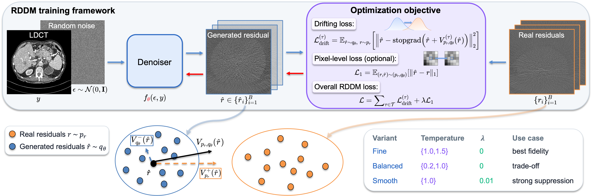

# RDDM: A Residual-Driven Drifting Model for High-Fidelity Low-Dose CT Denoising

[](https://arxiv.org/abs/2605.17188)
[](https://pypi.org/project/rddm/)

Official code release for **RDDM: A Residual-Driven Drifting Model for High-Fidelity Low-Dose CT Denoising** by Jianxu Wang, Qing Lyu, and Ge Wang.

> Our Team: [WANG-AXIS Lab](https://wang-axis.github.io/)

## Introduction

RDDM is an efficient and high-fidelity LDCT denoising method based on a residual-driven drifting model. It incorporates the multi-step evolution from the generated residual distribution to the real residual distribution into the training dynamics through a residual drifting field, thereby enabling one-step denoising at inference time. Experiments on clinical datasets show that RDDM achieves state-of-the-art denoising performance among supervised baselines.

<p align="center">
  
</p>

<p align="center"><em>Fig. 1. Overview of RDDM. The top panel shows the training framework: the denoiser generates residual samples, while the objective is computed from the full generated residual batch and real residual batch. The bottom panels illustrate training-time drifting toward the real residual distribution and summarize the three RDDM variants.</em></p>


## RDDM Variants

The paper reports three RDDM variants, providing practical choices from fine-detail fidelity to stronger noise suppression. They share the same RDDM framework; only the drifting temperatures and optional pixel-level L1 supervision differ.

| Variant | `--temperatures` | `--lambda_l1` | Intended use | Pretrained weights |
| --- | --- | ---: | --- | --- |
| RDDM-Fine | `1.0,1.5` | `0` | Best fidelity; preserves realistic anatomical texture and noise characteristics. | [Download](https://drive.google.com/file/d/1WO0imP0_8diJX0MXQTZlhe1jrkfgwAHz/view?usp=drive_link) |
| RDDM-Balanced | `0.2,1.0` | `0` | Default trade-off between noise suppression and detail preservation. | [Download](https://drive.google.com/file/d/1U4ikII3xSH30jDfFInfINM5K-CTTRMex/view?usp=drive_link) |
| RDDM-Smooth | `1.0` | `0.01` | Stronger noise suppression with smoother reconstructions. | [Download](https://drive.google.com/file/d/1YcWiFCyKodjx9L76q4MaEWCfUMyIU1K4/view?usp=drive_link) |

* _The training and test sets strictly follow the split described in the paper and are kept independent throughout model training and inference._
* _Place the downloaded pretrained weights under the corresponding subfolders in `checkpoints/`._

## Installation

Tested environment:

- Python `3.10.20`
- PyTorch `2.6.0+cu124`
- CUDA `12.4`

Create a clean environment first:

```bash
conda create -n rddm python=3.10 -y
conda activate rddm
python -m pip install -U pip
```

Install a PyTorch build matching your CUDA version. For example, for CUDA 12.4:

```bash
pip install torch==2.6.0 torchvision==0.21.0 --index-url https://download.pytorch.org/whl/cu124
```

For other CUDA/CPU targets, use the [official PyTorch instructions](https://pytorch.org/get-started/locally/).

RDDM computes FID during dataset evaluation by default, so `torchvision` is installed together with `torch` to keep the PyTorch/FID dependency stack consistent.

### Option 1: Install from source

```bash
git clone https://github.com/Jayx-Wang/RDDM.git
cd RDDM
pip install -e .
```

### Option 2: Install the RDDM CLI

```bash
pip install rddm
```

After installation, the following commands are available:

```bash
rddm-train --help
rddm-infer-single --help
rddm-evaluate --help
```

## Data Preparation

The clinical dataset used in this work can be obtained from the official [AAPM Low Dose CT Grand Challenge](https://www.aapm.org/grandchallenge/lowdosect/) page. We use the subset reconstructed with the B30 kernel and a slice thickness of 1 mm.

The expected directory layout is:

```text
path/to/the/dataset/
├── train/
│   ├── ldct/
│   │   ├── *.IMA
│   │   └── ...
│   └── ndct/
│       ├── *.IMA
│       └── ...
└── test/
    ├── ldct/
    │   ├── *.IMA
    │   └── ...
    └── ndct/
        ├── *.IMA
        └── ...
```

Use `--data_dir /path/to/the/dataset` to specify your own dataset. Please ensure that LDCT and NDCT files are paired by matching filenames under the corresponding `ldct/` and `ndct/` folders.


## Quick Start

The commands below are for installation from source and should be run inside the cloned repository. If you use the CLI installation, check `rddm-train --help`, `rddm-infer-single --help`, and `rddm-evaluate --help` for the corresponding usage.

### Train RDDM-Fine

The following example trains RDDM-Fine with `--temperatures 1.0,1.5` and `--lambda_l1 0`. To train RDDM-Balanced or RDDM-Smooth manually, keep the same command structure and change the variant-specific arguments shown in the table above.

```bash
CUDA_VISIBLE_DEVICES=0 python train.py \
  --data_dir /path/to/the/dataset \
  --split_train train \
  --batch_size 24 \
  --ncpus 8 \
  --lr 1e-4 \
  --lr_decay_mode step \
  --lr_decay_step 10000 \
  --lr_decay_gamma 0.5 \
  --max_steps 50000 \
  --save_interval 10000 \
  --use_fp16 false \
  --max_norm 1.0 \
  --temperatures 1.0,1.5 \
  --lambda_l1 0 \
  --checkpointdir checkpoints/Custom/RDDM-Fine
```

* _Replace `/path/to/the/dataset` with the path to your prepared dataset._

* _Please adjust settings such as `--batch_size`, `--ncpus`, and precision according to your own GPU memory and hardware setup._
* _For multi-GPU training, launch with `torchrun` and keep the same script arguments._

### Easily Reproduce Our RDDM Variants

```bash
DATA_DIR=/path/to/the/dataset GPU=0 bash scripts/train_rddm_fine.sh
DATA_DIR=/path/to/the/dataset GPU=0 bash scripts/train_rddm_balanced.sh
DATA_DIR=/path/to/the/dataset GPU=0 bash scripts/train_rddm_smooth.sh
```

* _Replace `/path/to/the/dataset` with the path to your prepared dataset._
* _The default training parameters are configured for a single H100 80GB GPU._

### Single-Slice Inference

```bash
CUDA_VISIBLE_DEVICES=0 python infer_single.py \
  --ldct_path test_sample/ldct/L506_0081.IMA \
  --ndct_path test_sample/ndct/L506_0081.IMA \
  --checkpoint checkpoints/RDDM-Fine/rddm_fine_050000.pth \
  --hu_min -1024 \
  --hu_max 3072 \
  --window_center 40 \
  --window_width 400 \
  --use_fp16 false \
  --save_images true \
  --out_dir outputs/single_L506_0081
```


### Dataset Evaluation

```bash
CUDA_VISIBLE_DEVICES=0 python evaluate.py \
  --data_dir /path/to/the/dataset \
  --split test \
  --checkpoint checkpoints/RDDM-Fine/rddm_fine_050000.pth \
  --hu_min -1024 \
  --hu_max 3072 \
  --use_fp16 false \
  --num_test_samples 1 \
  --compute_fid true \
  --fid_batch_size 50 \
  --fid_dims 2048 \
  --fid_num_workers 8 \
  --save_npy true \
  --out_dir outputs/evaluate_rddm_fine
```

* _Replace `/path/to/the/dataset` with the path to your prepared dataset._

## Citation

If you use this code, please cite the paper below.

```bibtex
@article{wang2026rddm,
  title={RDDM: A Residual-Driven Drifting Model for High-Fidelity Low-Dose CT Denoising},
  author={Wang, Jianxu and Lyu, Qing and Wang, Ge},
  journal={arXiv preprint arXiv:2605.17188},
  year={2026}
}
```

